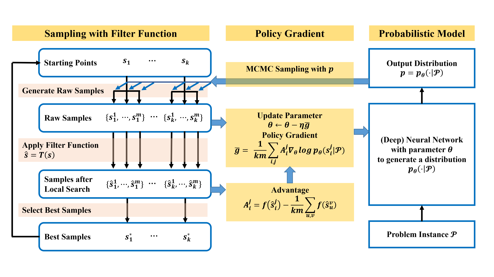

## MCPG 

**MCPG** is an efficient and stable framework for solving Binary Optimization problems based on a **M**onte **C**arlo **P**olicy **G**radient Method with Local Search:  
$$\min_x \quad f(x), \quad\mathrm{s.t.}\quad x_i \in \\{1,-1\\}.$$

## Algorithm
MCPG  consists of the following main components:

* a filter function $T(x)$ that enhances the objective function, reducing the probability of the algorithm from falling into local minima;

* a sampling procedure with filter function, which starts from the best solution found in previous steps and tries to keep diversity; 

* a modified policy gradient algorithm to update the probabilistic model;

* a probabilistic model that outputs a distribution $p_\theta(\cdot|\mathcal{P})$, guiding the sampling procedure towards potentially good solutions.

The pipeline of MCPG is demonstrated in the next figure. In each iteration, MCPG starts from the best samples of the previous iteration and performs MCMC sampling in parallel. The algorithm strives to obtain the best solutions with the aid of the powerful probabilistic model. To improve the efficiency, a filter function is applied to compute a modified objective function. At the end of the iteration, the probabilistic model is updated using policy gradient, ensuring to push the boundaries of what is possible in the quest for optimal solutions. 




## Code Structure
```
    ├── config         : Configuration files for various types of problems. 
    |                    See Examples for more details to use the configuration files.
    ├── data           : Problem instances selected for testing.
    |                    See Summary of Datasets to access the complete datasets presented
    |                    in the paper.
    └── src
        ├── mcpg.py          : Main file to run MCPG solver on specific problem data.
        ├── mcpg_solver.py   : Our MCPG solver. 
        ├── model.py         : The probabilistic model to output the mean-field distribution.
        ├── dataloader.py    : Data loader for MCPG to input the problem instance.
        └── sampling.py      : The sampling procedure combining with the local search algorithm in MCPG.
```
## Requirements
python 3.8, pytorch (>= 1.5.0), torch_scatter, torch_geometric, CUDA
## Usage
```
usage: python mcpg.py [-h] config_file problem_instance

positional arguments:
  config_file       input the configuration file for the mcpg solver
  problem_instance  input the data file for the problem instance
```
The following codes demonstrate how to integrate the mcpg solver into your program
```
from mcpg_solver import mcpg_solver
# load the config file and problem_data file as shown in mcpg.py
config = ...
problem_data = ...
# use mcpg_solver to obtain the solution
max_res, solution = mcpg_solver(config, problem_data)
# use the solution in the rest of the program
```
Although the experiments we show in the paper are running with GPU, the program automatically detects the devices and can also running on CPU without assistance of GPU device.  
## Examples
We first briefly introduce the problems tested in our paper, show how to use MCPG to solve the specific problems, and then present the partial results respectively for all the testing problems. The gap is defined as 
$$\mathrm{gap} = \frac{|\mathrm{UB} - \mathrm{obj}|}{\mathrm{UB}} \times 100 \\%$$
where $\mathrm{obj}$ is the objective value achieved by MCPG and other comparison algorithms, and $\mathrm{UB}$ denotes the best-known results.
### MaxCut
The MaxCut problem aims to divide a given weighted graph $G = (V,E)$ into two parts and maximize the total weight of the edges connecting two parts. This problem can be expressed as a binary programming problem:
$$\max  \quad  \sum_{(i,j) \in E} w_{ij} (1-x_i x_j), \quad \mathrm{s.t.}\quad  x\in \\{-1, 1\\}^n.$$

For solving maxcut problem using MCPG, run the following code

```
python src/mcpg.py config/maxcut_default.yaml data/graph/G14.txt
```

The following table shows the selected results for MaxCut on Gset datasets regardless of time limits. For BLS, DSDP, RUN-CSP and PI-GNN, we directly use the results presented in the referenced papers since their performance is highly dependent on the implementation. 
| Graph | Nodes   | Edges   | MCPG   | BLS    | DSDP   | RUN-CSP | PI-GNN | EO     | EMADM  |
|-------|---------|---------|--------|--------|--------|---------|--------|--------|--------|
| G14   | 800     | 4,694   | 3,064  | 3,064  | 2,922  | 2,943   | 3,026  | 3047   | 3045   |
| G15   | 800     | 4,661   | 3,050  | 3,050  | 2,938  | 2,928   | 2,990  | 3028   | 3034   |
| G22   | 2,000   | 19,990  | 13,359 | 13,359 | 12,960 | 13,028  | 13,181 | 13215  | 13297  |
| G49   | 3,000   | 6,000   | 6,000  | 6,000  | 6,000  | 6,000   | 5,918  | 6000   | 6000   |
| G50   | 3,000   | 6,000   | 5,880  | 5,880  | 5,880  | 5,880   | 5,820  | 5878   | 5870   |
| G55   | 5,000   | 12,468  | 10,296 | 10,294 | 9,960  | 10,116  | 10,138 | 10107  | 10208  |
| G70   | 10,000  | 9,999   | 9595   | 9,541  | 9,456  | -       | 9,421  | 8513   | 9557   |

The following table shows the detailed results for selected graphs of Gset within limited time.
|Problem| | MCPG| | MCPG-U | | EO | | EMADM | |
|-|-|-|-|-|-|-|-|-|-|
|name| UB     | gap | time     | gap| time    | gap   | time | gap| time   
|G22 | 13359  |  0.01 |  55    | 0.01    |  51  |  1.21 | 116 | 0.42   | 66
|	G23 | 13344  |  0.02 |  56    | 0.07    |  51  | 0.95 | 116 | 0.39   | 66
|	G24 | 13337  |  0.03 |  56    | 0.04    |  51  | 0.97 | 116 | 0.32   | 60
|	G25 | 13340  |  0.07 |  55    | 0.08    |  51  | 0.95 | 115 | 0.45   | 66
|	G26 | 13328  |  0.08 |  55    | 0.10    |  50  | 0.92 | 115 | 0.36   | 66
|	G41 | 2405   |  0.00 |  54    | 0.08    |  50  | 4.46 | 106 | 1.93   | 84
|	G42 | 2481   |  0.00 |  54    | 0.28    |  50  | 4.21 | 106 | 2.70   | 84
|	G43 | 6660   |  0.00 |  28    | 0.00    |  26  | 0.96 | 45  | 0.32   | 24
### Quadratic Unconstrained Binary Optimization
QUBO is to solve the following problem:
$$\max \quad  x^\mathrm{T} Q x,\quad\mathrm{s.t.}\quad x\in \\{0, 1\\}^n.$$
The sparsity of $Q$ in our experiments is greater than $0.5$, which fundamentally differs from instances derived from graphs such as Gset dataset, where the sparsity is less than $0.1$.

For solving QUBO problem using MCPG, run the following code
```python
python src/mcpg.py config/qubo_default.yaml data/nbiq/nbiq_500.npy
```
The following table shows the results for QUBO on the large instances of Biq Mac Library.
| Problem     || MCPG | | MCPG-U| | MCPG-P | | EMADM | |
|-|-|-|-|-|-|-|-|-|-|
|Name|UB|gap|time|gap|time|gap|time|gap|time|
b2500.1|1515944|0.00000|23|0.00000|26|0.00482|43|0.00000|27
b2500.2|1471392|0.01183|57|0.01604|71|0.02827|79|0.01883|29
b2500.3|1414192|0.00106|42|0.00198|38|0.00438|38|0.01782|33
b2500.4|1507701|0.00000|21|0.00000|22|0.00000|32|0.00000|29
b2500.5|1491816|0.00000|30|0.00000|28|0.00684|49|0.01629|28
b2500.6|1469162|0.00000|32|0.00000|37|0.00776|52|0.00000|29
b2500.7|1479040|0.00000|38|0.00000|33|0.01643|55|0.02833|32
b2500.8|1484199|0.00000|27|0.00000|28|0.01159|59|0.01536|31
b2500.9|1482413|0.00000|31|0.00000|30|0.00492|53|0.00169|27
b2500.10|1483355|0.01079|53|0.01220|52|0.01692|72|0.02986|27

The following table shows the selected results for QUBO on the generated NBIQ datasets.

| Problem      | MCPG | | MCPG-U| | MCPG-P | | EMADM | |
|--------------|-------------------------|-------------------------|-------|-------|-------|------|------|------|
| Name         | gap                     | time                    | gap                  | time | gap   | time | gap  | time |
| nbiq.5000.1                      | 0.42 | 364                                     | 0.45  | 361   |0.63  | 364  | 1.33 | 356  |
| nbiq.5000.2                      | 0.50 | 368                                      | 0.52  | 364   |1.08  | 365  | 1.45 | 361  |
| nbiq.5000.3                      | 0.56 | 370                                     | 0.68  | 369  | 0.97  | 378  | 1.23 | 357  |
| nbiq.7000.1                      | 0.39 | 513                                      | 0.43  | 510  | 0.60  | 512  | 1.38 | 1132 |
| nbiq.7000.2                      | 0.44 | 509                                      | 0.50  | 507  | 0.75  | 510  | 1.27 | 1147 |
| nbiq.7000.3                    | 0.61 | 515                                      | 0.90  | 510  | 1.24  | 512  | 1.47 | 1139 |

### Cheeger Cut
Cheeger cut is a kind of balanced graph cut, which are widely used in classification tasks and clustering. Given a graph $G = (V, E, w)$, the ratio Cheeger cut (RCC) and the normal Cheeger cut (NCC) are defined as
$$\mathrm{RCC}(S, S^c)  = \frac{\mathrm{cut}(S,S^c)}{\min\\{|S|, |S^c|\\}},\quad\mathrm{NCC}(S, S^c)  = \frac{\mathrm{cut}(S,S^c)}{|S|} + \frac{\mathrm{cut}(S,S^c)}{|S^c|},$$
where $S$ is a subset of $V$ and $S^c$ is its complementary set. The task is to find the minimal ratio Cheeger cut or normal Cheeger cut, which can be converted into the following binary unconstrained programming:
$$\min \quad \frac{\sum_{(i,j)\in E}(1-x_ix_j)}{\min \sum_{i=1:n} (1 + x_i), \sum_{i=1:n} (1 - x_i)},\quad \mathrm{s.t.} \quad x\in\\{-1,1\\}^n,$$ 
and 
$$\min\quad \frac{\sum_{(i,j)\in E}(1-x_ix_j)}{\sum_{i=1:n} (1 + x_i)} + \frac{\sum_{(i,j)\in E}(1-x_ix_j)}{\sum_{i=1:n} (1 - x_i)},\quad \mathrm{s.t.} \quad x\in\\{-1,1\\}^n.$$

For solving the Cheeger cut problem using MCPG, run the following code
```python
python src/mcpg.py config/rcheegercut_default.yaml data/graph/G14.txt
python src/mcpg.py config/ncheegercut_default.yaml data/graph/G14.txt
```
The following table shows the selected results for normal Cheeger cut on Gset dataset.
Problem | MCPG| | MCPG-U | | MCPG-P | | pSC | |
|-|-|-|-|-|-|-|-|-|
Name    | NCC | time | NCC |time | NCC| time | NCC   | time     
G22|0.280|43|0.283|39|0.284|41|0.375|136 
G23|0.296|44|0.305|46|0.309|42|0.373|137 
G24|0.366|41|0.368|40|0.375|44|0.449|132 
G25|0.258|41|0.259|43|0.286|44|0.388|134 
G26|0.272|42|0.281|42|0.284|40|0.416|134 
G43|0.327|28|0.337|23|0.333|23|0.427|71 
G44|0.308|28|0.312|27|0.353|26|0.421|67 
G45|0.361|30|0.372|28|0.364|24|0.447|70 
G46|0.297|25|0.311|25|0.337|27|0.378|68 
### MIMO
The MIMO problem is to recover $x_C \in \mathcal Q$ from the linear model
$$y_C = H_Cx_C+\nu_C,$$
where $y_C\in \mathbb C^M$ denotes the received signal, $H_C\in \mathbb C^{M\times N}$ is the channel, $x_C$ denotes the sending signal, and $\nu_C\in \mathbb C^N\sim \mathcal N(0,\sigma^2I_N)$ is the Gaussian noise with known variance. 
 
The problem can be reduced to a binary one and is equivalent to the following: 
$$\min_{x\in\mathbb{R}^{2N}}\quad\|Hx-y\|_2^2,\quad\mathrm{s.t.} \quad x\in \\{-1, 1\\}^{2N}.$$

For solving the MIMO problem using MCPG, run the following code
```python
python src/mcpg.py config/mimo_default.yaml data/mimo/4QAM180_1.npz
```
| Type   | LB        | MCPG                |       | HOTML               |       | MMSE                |       |
|--------|-----------|---------------------|-------|---------------------|-------|---------------------|-------|
|        | BER       | BER                 | time  | BER                 | time  | BER                 | time  |
| 800-2  | 0.103731  | 0.174669  | 0.50  | 0.192981            | 10.63 | 0.177175            | 0.10  |
| 800-4  | 0.056331  | 0.126675   | 1.00  | 0.146444            | 11.88 | 0.140519            | 0.10  |
| 800-6  | 0.023131  | 0.069094   | 3.96  | 0.082063            | 13.47 | 0.105463            | 0.10  |
| 800-8  | 0.006300  | 0.012150   | 3.29  | 0.012188            | 6.22  | 0.074900            | 0.10  |
| 1200-2 | 0.104883  | 0.174588  | 1.00  | 0.193192            | 82.46 | 0.177675            | 0.45  |
| 1200-4 | 0.056400  | 0.127004   | 1.94  | 0.145813            | 77.83 | 0.140567            | 0.47  |
| 1200-6 | 0.023179  |0.070346   | 6.47  | 0.083738            | 73.94 | 0.105979            | 0.47  |
| 1200-8 | 0.006179  | 0.012529   | 7.39  | 0.012654            | 61.59 | 0.075567            | 0.47  |

### MaxSAT
The MaxSAT problem is to find an assignment of the variables that satisfies the maximum number of clauses in a boolean formula in conjunctive normal form (CNF). Given a formula in CNF consists of clause $c^1,c^2,\cdots,c^m$, we formulate the partial MaxSAT problem as a penalized binary programming problem:
$$\max \quad \sum_{c^i \in C_1\cup C_2} w_i\max\\{c_1^i x_1, c_2^i x_2,\cdots, c_n^i x_n , 0\\},\quad \text{s.t.} \quad  x \in \\{-1,1\\}^n,$$
where $w_i = 1$ for $c^i \in C_1$ and $w_i = |C_1| + 1$ for $c^i \in C_2$. $C_1$ represents the soft clauses that should be satisfied as much as possible and $C_2$ represents the hard clauses that have to be satisfied. 

$c_j^i$ represents the sign of literal $j$ in clause $i$. $c_j^i = 1$ when $x_j$ appears in the clause $C_i$, $c_j^i = -1$ when $\neg x_j$ appears in the clause $C_i$ and  otherwise $c_j^i = 0$.

For solving the MaxSAT problem using MCPG, run the following code
```python
python src/mcpg.py config/maxsat_default.yaml data/sat/randu_1.cnf
```
For solving the partial maxsat problem using MCPG, run the following code
```python
python src/mcpg.py config/pmaxsat_default.yaml data/partial_sat/clq1-cv160c800l2g1.wcnf
```

The following table shows the selected results for MaxSAT without hard clauses on the generated difficult dataset.
|Problem | | | MCPG || WBO | | WBO-inc | | SATLike | |
|-|-|-|-|-|-|-|-|-|-|-|
|nvar| nclause | UB | gap | time | gap | time | gap  | time| gap | time  | gap | time
|2000 | 10000 | 8972  |  0.01 | 39  |  6.88  | 60       | 5.49 | 60| 0.12 | 60 
|2000 | 10000 | 8945  |  0.01 | 39  |  6.47  | 60       | 5.62 | 60| 0.15 | 60 
|2000 | 10000 | 8969  |  0.01 | 39  |  7.08  | 60       | 5.74 | 60| 0.12 | 60 
|2000 | 10000 | 8950  |  0.01 | 38  |  6.74  | 60       | 5.89 | 60| 0.13 | 60 
|2000 | 10000 | 8937  |  0.01 | 39  |  6.22  | 60       | 5.99 | 60| 0.12 | 60 

The following table shows the selected results for partial MaxSAT on MSE2016 random track. The time limits of WBO and WBO-inc are the same as SATlike.
|Problem | | | | MCPG | | WBO| WBO-inc| SATLike | |
|-|-|-|-|-|-|-|-|-|-|
name | C_2 | C_1|  UB | gap  | time | gap | gap | gap | time  
min2sat-800-1   | 4013 | 401 | 340 | 0.00 |  27 | 24.41 | 2.35 | 1.47          | 60  
min2sat-800-2   | 3983 | 401 | 352 | 0.00 |  27 | 24.43 | 0.85 | 0.85          | 60 
min2sat-800-3   | 3956 | 400 | 340 | 0.00 |  27 | 22.35 | 1.76 | 0.59          | 60 
min2sat-800-4   | 3933 | 398 | 349 | 0.00 |  27 | 26.36 | 2.58 | 1.72          | 60 
min2sat-800-5   | 3871 | 402 | 353 | 0.00 |  27 | 20.11 | 1.70 | 0.28 | 60 
min2sat-1040-1  | 4248 | 525 | 458 | 0.00 |  32 | 21.62 | 2.40 | 0.22          | 60 
min2sat-1040-2  | 4158 | 528 | 473 | 0.00 |  33 | 22.83 | 1.27 | 0.21          | 60 
min2sat-1040-3  | 4194 | 527 | 473 | 0.00 |  33 | 17.12 | 0.21 | 0.42          | 60 
min2sat-1040-4  | 4079 | 520 | 474 | 0.00 |  33 | 18.57 | 1.69 | 0.21          | 60 
min2sat-1040-5  | 4184 | 523 | 465 | 0.43 |  33 | 17.42 | 1.29 | 0.00 | 60 
## Summary of Datasets 

We list the downloading links to the datasets used in the papers for reproduction.

* Gset instance: http://www.stanford.edu/yyye/yyye/Gset
* Generated large regular graph datasets: http://faculty.bicmr.pku.edu.cn/~wenzw/code/regular_graph.zip
* Generated NBIQ datasets: http://faculty.bicmr.pku.edu.cn/~wenzw/code/nbiq.zip
* Generated MaxSAT datasets: http://faculty.bicmr.pku.edu.cn/~wenzw/code/maxsat.zip
* Max-SAT Evaluation 2016: [Max-SAT 2016 - Eleventh Max-SAT Evaluation (udl.cat)](http://maxsat.ia.udl.cat/benchmarks/)
* MIMO Simulation: http://faculty.bicmr.pku.edu.cn/~wenzw/code/mimo.zip 

## Contact 

We hope that the package is useful for your application. If you have any bug reports or comments, please feel free to email one of the toolbox authors:

- Cheng Chen, chen1999 at pku.edu.cn
- Ruitao Chen, chenruitao at stu.pku.edu.cn
- Tianyou Li, tianyouli at stu.pku.edu.cn
- Zaiwen Wen, wenzw at pku.edu.cn

## Reference
[Cheng Chen, Ruitao Chen, Tianyou Li, Zaiwen Wen, Pengxiang Xu, A Monte Carlo Policy Gradient Method with Local Search for Binary Optimization, arXiv:2307.00783, 2023.](https://arxiv.org/abs/2307.00783)

## License
GNU General Public License v3.0
