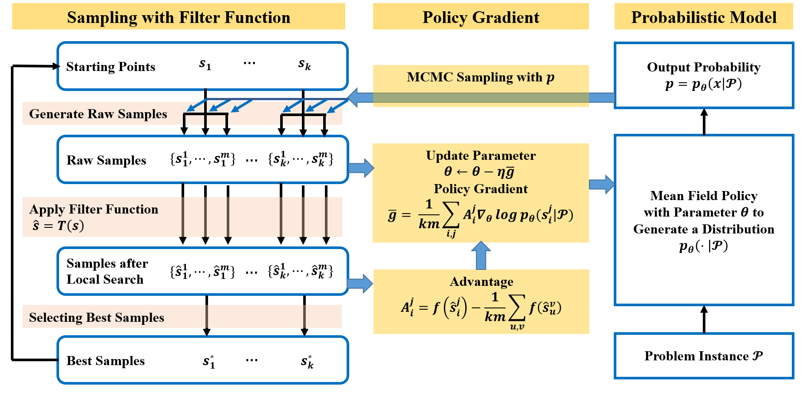

## MCPG 

**MCPG** is an efficient and stable framework for solving Binary Optimization problems based on a **M**onte **C**arlo **P**olicy **G**radient Method with Local Search:  
\[ \min_x f(x), \; x_i \in \{1,-1\}.\] 

## Quick Start

For maxcut problem with instance G14 in Gset, run the following code:

```python
python mcpg.py config/maxcut_default.yaml data/graph/G14.txt
```

## Examples

### maxcut

```python
python mcpg.py config/maxcut_default.yaml data/graph/G14.txt
```

### QUBO

```python
python mcpg.py config/qubo_default.yaml data/nbiq/nbiq_5000_1.npy
```

### Cheeger Cut

```python
python mcpg.py config/cheegercut_default.yaml data/graph/G14.txt
```

### MIMO

```python
python mcpg.py config/mimo_default.yaml data/mimo/~.mat
```

### MaxSAT

```python
python mcpg.py config/maxsat_default.yaml data/sat/randu_1.cnf
```


## Algorithm

**MCPG** is an efficient and stable framework for solving Binary Optimization problems. The pipeline of MCPG is demonstrated in the figure and descripted as follows:

1. In each iteration, the sampling distribution is obtained from the the efficient probabilistic model. 
2. MCPG starts from the best samples of the previous iteration and performs MCMC sampling in parallel.  
3. A filter function is applied to compute a modified objective function. 
4. At the end of the iteration, the probabilistic model is updated with policy gradient, ensuring to push the boundaries of what is possible in the quest for optimal solutions.



## Code Structure

- mcpg.py: Our MCPG solver.
- model.py: The probabilistic model to output the mean-field distribution.
- dataloader.py: Data loader for mcpg to input the problem instance.
- sampling.py: The sampling procedure combining with the local search algorithm in MCPG.

## Datasets 

We list the downloading links to the datasets used in the papers for reproduction.

* Gset instance: http://www.stanford.edu/yyye/yyye/Gset
* Generated large regular graph datasets: http://faculty.bicmr.pku.edu.cn/~wenzw/code/regular_graph.zip
* Generated NBIQ datasets: http://faculty.bicmr.pku.edu.cn/~wenzw/code/nbiq.zip
* Generated MaxSAT datasets: http://faculty.bicmr.pku.edu.cn/~wenzw/code/maxsat.zip
* Max-SAT Evaluation 2016: [Max-SAT 2016 - Eleventh Max-SAT Evaluation (udl.cat)](http://maxsat.ia.udl.cat/benchmarks/)
* MIMO Simulation: http://faculty.bicmr.pku.edu.cn/~wenzw/code/mimo.zip 

## Contact 

We hope that the package is useful for your application. If you have any bug reports or comments, please feel free to email one of the toolbox authors:

- Cheng Chen, chen1999 at pku.edu.cn
- Ruitao Chen, chenruitao at stu.pku.edu.cn
- Tianyou Li, tianyouli at stu.pku.edu.cn
- Zaiwen Wen, wenzw at pku.edu.cn

## Reference

Argelich J, Li C M, Manya F, et al. MaxSAT evaluation (2016)[J]. 2015.

## License